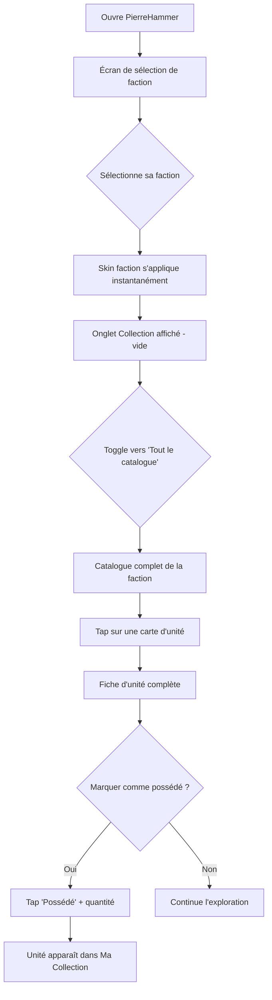
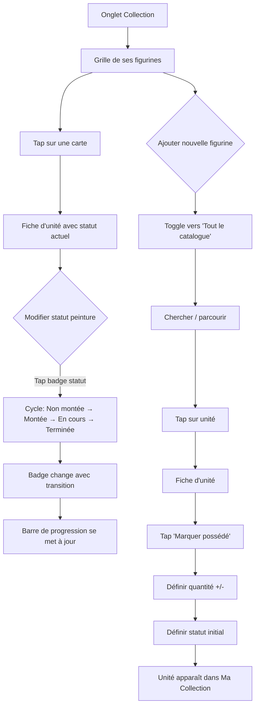
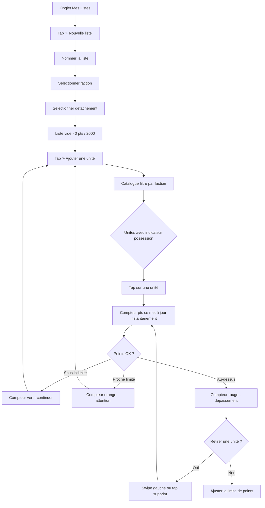
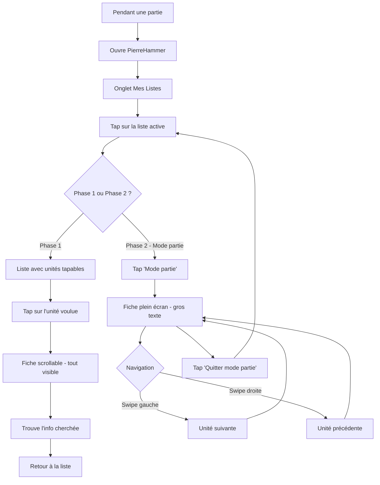
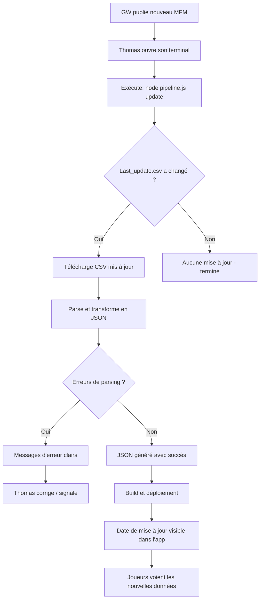

# UX Design Specification — PierreHammer

**Author:** Thomas
**Date:** 2026-03-31

---

<!-- UX design content will be appended sequentially through collaborative workflow steps -->

## Résumé exécutif UX

### Vision projet

PierreHammer fusionne gestion de collection, construction de listes d'armée et consultation de fiches d'unités Warhammer 40K dans une PWA immersive — un cadeau pour Pierre et son groupe de 5-6 joueurs. L'app se distingue par son identité visuelle dynamique par faction et son UX "tout visible d'un coup", pensée pour être utilisée smartphone en main pendant les parties.

### Utilisateurs cibles

| Profil | Archétype | Besoin UX prioritaire | Fréquence |
|---|---|---|---|
| Alex | Casual | Tout visible, zéro friction, mode partie | 1x/mois |
| Sophie | Peintre/Collectionneuse | Suivi progression, galerie visuelle | 3-4x/semaine |
| Marc | Compétiteur | Calcul points, validation, multi-listes | 2-3x/semaine |
| Thomas | Mainteneur (dev) | Pipeline simple, pas de maintenance code | Trimestriel |

**Persona de référence UX :** Alex (le casual). Si Alex s'y retrouve sans aide, tout le monde s'y retrouve.

### Défis design clés

1. **Densité d'information sur mobile** — Afficher des datasheets complètes (stats, armes, capacités, mots-clés, points) sur un écran 360px sans accordéon ni pagination, tout en restant lisible
2. **Fusion tri-fonctionnelle** — Chaque vue d'unité combine données de jeu, état de collection et actions army builder — 3 couches d'information à rendre naturelles et non surchargées
3. **Dualité contextuelle** — Mode préparation (maison, gestion détaillée) vs mode partie (table de jeu, lecture rapide, gros texte, swipe) — deux UX dans une seule app

### Opportunités design

1. **Identité visuelle par faction** — L'app change de peau (couleurs, typo, fonds, icônes) selon la faction — moment "wow" unique, aucune app concurrente ne le fait
2. **Cartes animées premium** — Basées sur du code existant fourni par Thomas (dossier de référence à intégrer). Parallaxe CSS, brillance, cadres dorés (Epic Heroes) / argentés (Battleline) — transforme la consultation en expérience émotionnelle
3. **Feedback de possession** — La distinction visuelle possédé/non possédé omniprésente crée un loop motivationnel (envie de compléter sa collection et ses listes)

## Expérience utilisateur core

### Interaction définissante

L'action core de PierreHammer est la **consultation de fiche d'unité**. C'est le carrefour de toutes les fonctionnalités : le casual y lit ses stats en partie, la peintre y voit sa progression, le compétiteur y construit sa liste. Chaque fiche est un micro-univers autonome combinant données de jeu, état de collection et action d'army builder.

**Hiérarchie des actions :**

| Priorité | Action | Fréquence | Contexte |
|---|---|---|---|
| 1 | Consulter une fiche d'unité | Très haute | Partie, préparation, exploration |
| 2 | Ajouter/modifier une unité dans la collection | Haute | Après achat ou session peinture |
| 3 | Construire/éditer une liste d'armée | Moyenne | Avant une partie ou un tournoi |
| 4 | Naviguer entre unités en mode partie | Haute (pendant partie) | Smartphone sur table de jeu |

### Stratégie plateforme

- **PWA mobile-first** — Écrans 360-428px, tactile, zones de tap 44x44px minimum
- **Offline-first** — Service workers cache-first, 100% fonctionnel sans connexion après premier chargement
- **Pas de backend** — Données utilisateur en localStorage, données de jeu en JSON statique intégré au build
- **Desktop secondaire** — Grille de cartes plus large, même fonctionnalités
- **Installation PWA** — Mode standalone, icône PierreHammer, splash screen

### Interactions sans friction

| Interaction | Cible | Comment |
|---|---|---|
| Premier accès | 0 étape — pas de login, pas d'onboarding | Sélection faction en 3 taps max |
| Changer un statut de peinture | 1 tap | Sélecteur d'état directement sur la carte |
| Ajouter une unité à une liste | 1 tap | Bouton contextuel sur chaque fiche |
| Naviguer entre unités (mode partie) | 1 swipe horizontal | Cartes plein écran swipables |
| Voir le total de points d'une liste | 0 action — toujours visible | Compteur persistant en haut de la vue liste |
| Basculer collection / catalogue | 1 tap | Toggle visible en permanence |

### Moments critiques de succès

1. **"Wow" du premier lancement** — Pierre choisit sa faction → skin dynamique s'applique → cartes animées apparaissent → réaction émotionnelle immédiate. C'est le moment "cadeau".
2. **Compréhension instantanée** — Un joueur ouvre une fiche d'unité pour la première fois → tout est visible, hiérarchisé, lisible → il trouve l'info en < 5 secondes sans aide.
3. **Autonomie en partie** — Alex swipe entre ses unités en mode partie → gros texte, stats claires → il ne demande plus "c'est quoi la Force de mes Hellblasters ?".
4. **Satisfaction de progression** — Sophie change un statut de peinture → la barre de progression avance → feedback visuel immédiat et gratifiant.
5. **Confiance du compétiteur** — Marc voit le compteur de points se mettre à jour instantanément → les unités non possédées sont clairement marquées → il sait exactement quoi emprunter.

### Principes d'expérience

1. **Tout visible, rien de caché** — Aucune information derrière un accordéon, un modal ou un sous-menu. La page scrollable est le pattern universel.
2. **La fiche est la reine** — Chaque fiche d'unité est auto-suffisante : données de jeu + collection + army builder en une seule vue. C'est l'ADN de l'app.
3. **L'app s'habille pour toi** — Le skin dynamique par faction n'est pas cosmétique, c'est l'identité. L'utilisateur doit sentir que l'app lui appartient.
4. **Zéro apprentissage** — Si tu dois expliquer comment ça marche, c'est raté. Walk-up playability absolue.
5. **Table-ready** — Chaque décision de design est testée contre : "est-ce que ça marche avec un smartphone posé sur la table de jeu, en pleine partie ?"

## Réponse émotionnelle visée

### Objectifs émotionnels primaires

**Émotion core : Fierté d'appartenance** — Le joueur doit sentir que PierreHammer est "son" app. Sa faction, ses figurines, ses listes, ses couleurs. Le skin dynamique par faction est le vecteur principal de cette émotion — l'app se transforme pour lui.

**Émotion secondaire : Émerveillement** — Le wow factor visuel (cartes animées, skin faction, transitions fluides) doit provoquer un "c'est beau" spontané. C'est un cadeau — la première impression EST le cadeau.

**Émotion tertiaire : Confiance** — Le joueur sait ce qu'il a, ce qu'il joue, combien ça coûte en points. Pas de doute, pas de vérification externe nécessaire.

### Parcours émotionnel

| Moment | Émotion | Levier UX |
|---|---|---|
| Premier lancement | Émerveillement | Skin faction immédiat, cartes animées, qualité visuelle inattendue |
| Choix de faction | Appartenance | L'app change de personnalité — c'est "ma" version |
| Exploration de la collection | Satisfaction | Galerie de cartes visuellement riche, progression visible |
| Mise à jour d'un statut peinture | Micro-accomplissement | Feedback visuel immédiat, barre de progression qui avance |
| Construction de liste | Confiance | Compteur temps réel, indicateurs possession clairs |
| Mode partie | Sérénité | Tout sous la main en un swipe, gros texte lisible |
| Retour après absence (casual) | Familiarité | État préservé, reprise immédiate sans re-apprendre |

### Micro-émotions design

| À cultiver | À éviter | Implication design |
|---|---|---|
| Confiance | Confusion | Navigation intuitive, labels clairs, pas d'acronymes non expliqués |
| Accomplissement | Culpabilité | La progression motive, ne juge jamais — pas de "tu n'as peint que 30%" |
| Excitation | Anxiété | Les alertes de points sont informatives, pas alarmistes |
| Fierté | Frustration | Le visuel premium donne envie de montrer l'app, pas de s'en excuser |
| Autonomie | Dépendance | L'app remplace les outils externes, pas besoin de Wahapedia à côté |

### Implications design

1. **Couleur et identité** — Le skin faction doit être appliqué dès le premier écran après sélection. Pas de transition "blanche" intermédiaire — le changement est immédiat et spectaculaire.
2. **Feedback positif** — Chaque interaction de progression (statut peinture, ajout collection) doit avoir un feedback visuel gratifiant (micro-animation, changement de couleur, progression).
3. **Ton bienveillant** — Les messages d'alerte (dépassement de points, unité non possédée) sont neutres et informatifs, jamais culpabilisants. "1975 / 2000 pts" plutôt que "Attention ! Limite presque atteinte !".
4. **Qualité perçue** — Même en Phase 1, le niveau de polish doit être suffisant pour que l'app ne donne jamais l'impression d'un prototype. C'est un cadeau — il doit avoir l'air fini.
5. **Easter eggs** — Des touches personnelles pour Pierre et le groupe (inside jokes, splash screen dédié) renforcent le sentiment "c'est fait pour nous".

### Principes de design émotionnel

1. **Le cadeau d'abord** — Chaque décision visuelle est testée contre : "est-ce que Pierre serait bluffé en voyant ça ?"
2. **Motiver, jamais juger** — La progression est un encouragement, pas un reproche. Formuler positivement.
3. **Premium mais pas froid** — L'esthétique carte à collectionner crée de la valeur perçue, mais le ton reste chaleureux et entre amis.
4. **Feedback immédiat** — Chaque action a une réponse visuelle instantanée. Le silence de l'interface est interdit.

## Analyse de patterns UX & inspiration

### Produits inspirants

#### Pokémon GO/Home — Collection émotionnelle
- **Ce qui fonctionne** : Chaque créature est une "carte" visuelle avec un sentiment de propriété fort. Le Pokédex crée un loop "j'ai / je n'ai pas" addictif. Les animations rendent l'expérience vivante.
- **Ce qu'on prend** : Cartes visuelles animées comme unité de base, toggle possédé/catalogue, feedback de complétion
- **Ce qu'on adapte** : Les cartes PierreHammer sont plus riches (stats, équipement, capacités) — pas juste une image et un nom

#### Steam — Bibliothèque organisée
- **Ce qui fonctionne** : Navigation claire (sidebar + grille), toggle "installé/tous les jeux", page de détail avec bannière → contenu scrollable
- **Ce qu'on prend** : Toggle collection/catalogue, structure page faction (bannière faction → grille d'unités), navigation 2 niveaux max
- **Ce qu'on adapte** : Mobile-first au lieu de desktop-first, bottom nav au lieu de sidebar

#### Strava — Progression gratifiante
- **Ce qui fonctionne** : Stats visuelles immédiates, barres de progression, micro-accomplissements. Chaque activité est un "moment de fierté"
- **Ce qu'on prend** : Barre de progression collection/peinture, feedback visuel à chaque mise à jour de statut
- **Ce qu'on adapte** : Pas de dimension sociale/compétitive au MVP — la progression est personnelle

#### Concurrents W40K — Ce qu'ils font bien et mal

| App | À prendre | À éviter |
|---|---|---|
| Wahapedia | Exhaustivité des données, structure par faction | Dense, pas de hiérarchie visuelle, pas mobile-first, pannes |
| New Recruit | Army builder moderne, UI propre | Pas de gestion de collection, pas offline, pas sur iOS |
| Battle Forge (officiel) | Données toujours à jour | Payant, buggé, UX critiquée par les utilisateurs, pas de collection |
| BattleBase | Scoring temps réel tournois | Trop spécialisé compétitif, pas de collection |

### Patterns UX transférables

**Patterns de navigation :**
- **Bottom tab bar 4 onglets** (iOS/Android standard) — Collection, Mes Listes, Catalogue, Profil. Pattern universel, compris par tous.
- **Scroll vertical infini** au lieu de pagination — les joueurs W40K sont habitués à scroller Wahapedia. Ne pas casser cette habitude.
- **Swipe horizontal** pour naviguer entre items d'une même liste (mode partie) — pattern Tinder/Stories, intuitif sur mobile.

**Patterns d'interaction :**
- **Tap-to-toggle** pour les statuts de peinture — pas de dropdown, pas de modal. Un sélecteur circulaire ou segmenté directement visible.
- **Compteur persistant** — Le total de points d'une liste reste visible en sticky header pendant le scroll.
- **Pull-to-refresh** absent — les données sont locales, pas de rafraîchissement. Simplicité.

**Patterns visuels :**
- **Cartes animées** (code existant de Thomas) — L'unité de base visuelle. Parallaxe au gyroscope/toucher, brillance, cadres typés.
- **Thèmes de couleur dynamiques** — CSS custom properties switchées par faction. Même architecture que les dark/light modes, mais en multi-thème.
- **Indicateurs d'état inline** — Badges de statut de peinture et indicateurs de possession directement sur les cartes, pas dans un menu séparé.

### Anti-patterns à éviter

1. **Accordéons / collapse** — Pain point #1 identifié par les utilisateurs W40K. Wahapedia et Battle Forge cachent l'info. PierreHammer montre tout.
2. **Modals de confirmation** — "Êtes-vous sûr ?" tue la fluidité. Actions réversibles plutôt que confirmations.
3. **Onboarding forcé** — Slides de bienvenue, tutoriels, tours guidés. Le joueur doit comprendre seul en 3 taps.
4. **Loading spinners prolongés** — Données locales = tout est instantané. Pas de skeleton screens ou spinners sauf au tout premier chargement.
5. **Hamburger menu** — Cache la navigation. Bottom tab bar visible en permanence.
6. **Notifications push** — App privée, pas de backend. Pas de notifications. Simplicité.

### Stratégie d'inspiration design

**Adopter tel quel :**
- Bottom tab bar 4 onglets (standard mobile)
- Toggle collection/catalogue (Steam)
- Scroll vertical continu (Wahapedia habitue)
- Swipe horizontal mode partie (Tinder/Stories)

**Adapter au contexte :**
- Cartes animées Pokémon → cartes de figurines W40K avec stats intégrées (code de Thomas)
- Progression Strava → progression peinture/collection sans dimension sociale
- Page détail Steam → fiche d'unité fusionnée (data + collection + army builder)

**Rejeter :**
- Accordéons (tous les concurrents)
- Onboarding/tutoriels (friction)
- Abonnement/login (Battle Forge)
- Dépendance réseau (Wahapedia)

## Fondation design system

### Choix du design system

**Approche retenue : Tailwind CSS + composants custom**

Pas de bibliothèque de composants tierce (MUI, Chakra, Ant Design). PierreHammer utilise Tailwind CSS comme fondation utility-first avec des composants React custom construits sur mesure.

### Justification

| Critère | Tailwind custom | Lib UI (MUI/Chakra) |
|---|---|---|
| Skin dynamique multi-faction | CSS variables natif, contrôle total | Theming limité, surcharge nécessaire |
| Cartes animées custom | Intégration directe du code de Thomas | Conflit avec les styles de la lib |
| Poids bundle | Léger (purge CSS) | +100-300 Ko de dépendance |
| Courbe d'apprentissage | Thomas connaît déjà Tailwind | Nouvelle API à apprendre |
| Composants W40K spécifiques | Construits sur mesure, parfaitement adaptés | N'existent pas, customisation forcée |
| Maintenance solo | Un seul paradigme, pas de couche d'abstraction | Dépendance aux mises à jour de la lib |

### Approche d'implémentation

**Design tokens via CSS custom properties :**

```css
:root {
  /* Tokens neutres (défaut) */
  --color-primary: #1a1a2e;
  --color-accent: #e94560;
  --color-bg: #16213e;
  --color-text: #eaeaea;
  --color-card-border: #333;
  --font-display: 'Oswald', sans-serif;
}

[data-faction="space-marines"] {
  --color-primary: #1b3a6b;
  --color-accent: #c4a535;
  --color-bg: #0d1f3c;
  --font-display: 'Cinzel', serif;
}

[data-faction="orks"] {
  --color-primary: #2d4a1e;
  --color-accent: #ff6b35;
  --color-bg: #1a2e0f;
  --font-display: 'Black Ops One', sans-serif;
}
```

**Tailwind intégration :** Les tokens sont mappés dans `tailwind.config.ts` via `theme.extend.colors` pour utiliser `bg-primary`, `text-accent`, etc. Le changement de faction switche l'attribut `data-faction` sur le `<html>` — tout le thème change instantanément.

**Composants custom à construire :**

| Composant | Priorité | Description |
|---|---|---|
| `UnitCard` | Phase 1 | Carte de figurine — image, nom, points, indicateurs possession/peinture |
| `UnitSheet` | Phase 1 | Fiche complète scrollable — stats, armes, capacités, actions |
| `ArmyListHeader` | Phase 1 | Header sticky — nom liste, compteur points, faction |
| `StatusBadge` | Phase 1 | Badge statut peinture (4 états) — tap-to-toggle |
| `PointsCounter` | Phase 1 | Compteur de points temps réel avec indicateur limite |
| `FactionSelector` | Phase 1 | Sélecteur de faction avec preview du skin |
| `CollectionToggle` | Phase 1 | Toggle "Ma collection" / "Tout le catalogue" |
| `AnimatedCard` | Phase 2 | Carte animée — parallaxe, brillance, cadres or/argent (code Thomas) |
| `PartySwiper` | Phase 2 | Navigation swipe entre fiches en mode partie |
| `BottomNav` | Phase 1 | Barre de navigation 4 onglets |

### Stratégie de customisation

1. **Thème = données, pas code** — Chaque faction est un objet JSON de tokens (couleurs, fonts, icônes, image de fond). Ajouter une faction = ajouter un objet, pas toucher au code.
2. **Composants agnostiques du thème** — Les composants utilisent les tokens Tailwind (`bg-primary`, `text-accent`), jamais de couleurs en dur. Le thème coule naturellement.
3. **Animations découplées** — Le code de cartes animées de Thomas est encapsulé dans `AnimatedCard`, réutilisable sur toute carte. Les animations CSS sont indépendantes du thème.
4. **Responsive par défaut** — Chaque composant est mobile-first. Les breakpoints Tailwind (`md:`, `lg:`) adaptent pour desktop.

## Expérience définissante

### L'interaction signature

**"Ouvre la fiche, tout est là."**

PierreHammer en une phrase : chaque unité Warhammer 40K est une fiche unique qui réunit tout — règles, collection, army builder — en un seul scroll. Le joueur n'a plus besoin de jongler entre Wahapedia, New Recruit et un tableur.

C'est l'interaction que les joueurs décriront : "Tu ouvres ta figurine et tu as tout d'un coup — les stats, combien t'en as, et tu peux l'ajouter à ta liste direct."

### Modèle mental utilisateur

**Aujourd'hui (fragmenté) :**
1. "Je veux construire ma liste" → Ouvre New Recruit → ajoute des unités → "est-ce que j'ai cette figurine ?" → ouvre son tableur → vérifie → revient sur New Recruit
2. "C'est quoi les stats de cette unité ?" → Ouvre Wahapedia → cherche la faction → cherche l'unité → ouvre l'accordéon stats → ouvre l'accordéon armes → etc.
3. "J'ai peint quoi cette semaine ?" → Ouvre son tableur/app séparée → met à jour manuellement

**Avec PierreHammer (unifié) :**
1. "Je veux construire ma liste" → Ouvre Mes Listes → ajoute des unités → voit immédiatement ce qu'il possède ou non → terminé
2. "C'est quoi les stats ?" → Ouvre la fiche → tout est visible → terminé
3. "J'ai peint quoi ?" → Ouvre Collection → tap sur le statut → terminé

**Réduction cognitive :** De 3 outils + vérifications croisées à 1 app, 1 tap par action.

### Critères de succès de l'expérience core

| Critère | Mesure | Seuil |
|---|---|---|
| Compréhension immédiate | Un nouveau joueur trouve les stats d'une unité | < 5 secondes, sans aide |
| Fiche auto-suffisante | Aucune raison d'ouvrir un autre outil pendant une partie | 0 outil externe nécessaire |
| Réactivité | Ajout d'unité à une liste avec mise à jour du compteur | < 50ms perçu |
| Mémorabilité | Le joueur retrouve sa collection/liste au retour | État intact, 0 re-configuration |
| Walk-up playability | Alex (casual) utilise l'app seul | Aucune explication verbale nécessaire |

### Patterns : établis vs. innovants

**Patterns établis (adoptés tels quels) :**
- Bottom tab navigation — tout le monde sait l'utiliser
- Scroll vertical pour le contenu — universel
- Cartes en grille pour la galerie — pattern e-commerce/collection éprouvé
- Toggle switch pour les filtres — intuitif
- Sticky header avec info contextuelle — standard mobile

**Innovation par combinaison (la vraie différenciation) :**
- **Fiche fusionnée tri-fonctionnelle** — Personne ne combine data de jeu + collection + army builder sur une seule vue. C'est nouveau dans l'écosystème W40K, mais le pattern (page de détail scrollable) est familier. Innovation de contenu, pas d'interaction.
- **Skin faction dynamique** — Les dark/light modes existent, mais un thème qui change de personnalité (couleurs + typo + fonds + icônes) par faction est nouveau. Le mécanisme (CSS variables) est établi, l'application est innovante.
- **Possession inline** — Les indicateurs "possédé/non possédé" intégrés dans l'army builder sont nouveaux dans le domaine W40K, mais le pattern (badge sur item) est familier.

**Aucune interaction vraiment inédite** — On combine des patterns prouvés de façon innovante. Pas besoin d'éduquer les utilisateurs à de nouvelles interactions.

### Mécanique de l'expérience core

**1. Initiation — Accéder à une fiche d'unité**

| Depuis | Action | Contexte |
|---|---|---|
| Collection | Tap sur une carte d'unité | Gestion hobby, peinture |
| Catalogue | Tap sur une carte d'unité | Exploration, découverte |
| Mes Listes | Tap sur une unité dans la liste | Édition de liste, vérification |
| Mode partie | Swipe horizontal | Consultation rapide en jeu |
| Recherche | Tap sur un résultat | Accès direct par nom |

**2. Interaction — La fiche d'unité scrollable**

Structure de haut en bas (scroll vertical) :

```
┌─────────────────────────────┐
│ [Image figurine]            │ ← Carte visuelle (animée Phase 2)
│ Nom unité         XX pts    │
│ [Possédé: 3] [Statut: ██▒] │ ← Indicateurs collection inline
│ [+ Ajouter à ma liste ▼]   │ ← Action army builder
├─────────────────────────────┤
│ PROFIL                      │
│ M | T | Sv | W | Ld | OC   │ ← Stats en tableau compact
│ 6"| 4 | 3+ | 2 | 6+ | 2   │
├─────────────────────────────┤
│ ARMES DE TIR                │
│ Bolt rifle  24" A2 BS3+ S4… │ ← Armes en tableau
├─────────────────────────────┤
│ ARMES DE MÊLÉE              │
│ Close combat  A3 WS3+ S4…  │
├─────────────────────────────┤
│ CAPACITÉS                   │
│ • Oath of Moment (core)     │ ← Capacités listées
│ • Tactical Flexibility      │
├─────────────────────────────┤
│ MOTS-CLÉS                   │
│ INFANTRY · BATTLELINE ·     │ ← Tags scrollables
│ IMPERIUM · TACTICUS         │
├─────────────────────────────┤
│ OPTIONS D'ÉQUIPEMENT        │
│ • Peut remplacer bolt rifle │ ← Options textuelles
│   par astartes chainsword   │
└─────────────────────────────┘
```

**3. Feedback — Réponses visuelles**

| Action utilisateur | Feedback |
|---|---|
| Tap "Ajouter à ma liste" | Micro-animation de confirmation, compteur de points se met à jour |
| Tap sur statut de peinture | Le badge change d'état avec transition, barre de progression évolue |
| Tap sur quantité possédée | +1/-1 avec animation numérique |
| Scroll de la fiche | Smooth scroll natif, sections clairement séparées |
| Dépassement de limite de points | Le compteur change de couleur (accent → warning), pas d'alerte intrusive |

**4. Complétion — Retour au contexte**

| Depuis | Retour | État préservé |
|---|---|---|
| Collection | Retour à la grille de cartes | Position de scroll, filtres actifs |
| Mes Listes | Retour à la liste en cours d'édition | Unité ajoutée, compteur mis à jour |
| Mode partie | Swipe vers la fiche suivante/précédente | Position dans la liste de partie |

## Fondation design visuel

### Système de couleurs

**Architecture multi-thème par faction**

PierreHammer n'a pas UN thème — il en a autant que de factions. La palette de base (tokens neutres) sert de fallback et d'état par défaut avant la sélection de faction.

**Tokens de couleur sémantiques :**

| Token | Rôle | Exemple (neutre) |
|---|---|---|
| `--color-bg` | Fond principal | `#0f0f1a` (noir bleuté profond) |
| `--color-surface` | Surfaces élevées (cartes, headers) | `#1a1a2e` |
| `--color-primary` | Accent principal faction | `#e94560` (rouge vif) |
| `--color-accent` | Accent secondaire | `#c4a535` (or) |
| `--color-text` | Texte principal | `#eaeaea` |
| `--color-text-muted` | Texte secondaire | `#8a8a9a` |
| `--color-success` | Statut "Terminé", validation | `#4ade80` |
| `--color-warning` | Dépassement de points, attention | `#fbbf24` |
| `--color-error` | Erreur de composition | `#ef4444` |
| `--color-card-epic` | Bordure carte Epic Hero | `#c4a535` (or) |
| `--color-card-battleline` | Bordure carte Battleline | `#a0a0b0` (argent) |
| `--color-card-standard` | Bordure carte standard | `var(--color-surface)` |

**Direction visuelle globale : Dark mode exclusif.** L'univers W40K est sombre et dramatique — un fond sombre met en valeur les images de figurines et renforce l'immersion. Pas de light mode.

**Exemples de palettes faction (indicatifs) :**

| Faction | Primary | Accent | Bg | Ambiance |
|---|---|---|---|---|
| Space Marines (Ultramarines) | `#1b3a6b` bleu royal | `#c4a535` or impérial | `#0d1f3c` | Noble, martial |
| Orks | `#2d4a1e` vert brutal | `#ff6b35` orange feu | `#1a2e0f` | Sauvage, chaotique |
| Aeldari | `#1a3a3a` teal mystique | `#e8c547` or ancien | `#0d1f2a` | Élégant, éthéré |
| Tyranides | `#3a1a3a` violet organique | `#e94560` rouge chair | `#1f0d1f` | Biologique, alien |
| Necrons | `#1a1a1a` noir métallique | `#00ff88` vert gauss | `#0a0a0a` | Froid, mécanique |
| Chaos | `#2a0a0a` rouge sang | `#ff4444` rouge vif | `#150505` | Corrompu, menaçant |

*Les palettes finales seront affinées pendant l'implémentation avec les vrais visuels de faction.*

### Système typographique

**Stratégie : Double police avec variation par faction**

| Usage | Police par défaut | Taille mobile | Comportement |
|---|---|---|---|
| Display (nom faction, titres) | `var(--font-display)` — Oswald par défaut | 24-32px | Change par faction |
| Headings (sections fiche) | Inter Bold | 16-20px | Fixe |
| Body (stats, descriptions) | Inter Regular | 14-16px | Fixe |
| Mono (valeurs de stats) | JetBrains Mono | 14px | Fixe |
| Mode partie (gros texte) | Inter Bold | 20-28px | Agrandi x1.5 |

**Polices display par faction (indicatif) :**
- Space Marines → Cinzel (serif impérial)
- Orks → Black Ops One (brut, épais)
- Aeldari → Quicksand (élégant, arrondi)
- Necrons → Orbitron (géométrique, froid)
- Par défaut → Oswald (condensé, militaire)

**Échelle typographique :**
- Base : 16px
- Ratio : 1.25 (Major Third)
- `text-xs`: 12px / `text-sm`: 14px / `text-base`: 16px / `text-lg`: 20px / `text-xl`: 24px / `text-2xl`: 32px

### Système d'espacement & layout

**Unité de base : 4px**

| Token | Valeur | Usage |
|---|---|---|
| `space-1` | 4px | Padding interne minimal |
| `space-2` | 8px | Espacement entre éléments liés |
| `space-3` | 12px | Padding de composant |
| `space-4` | 16px | Marge entre sections |
| `space-6` | 24px | Séparation de blocs |
| `space-8` | 32px | Marge entre grandes sections |

**Layout mobile-first :**
- Largeur max contenu : 428px (iPhone 14 Pro Max)
- Padding horizontal : 16px
- Grille de cartes : 2 colonnes sur mobile (< 428px), 3-4 sur tablette, 5-6 sur desktop
- Gap entre cartes : 12px
- Bottom nav height : 56px + safe area
- Sticky header height : 48px

**Densité d'information :**
- Mode normal : espacement aéré (space-3 à space-4 entre éléments)
- Mode partie : espacement réduit pour maximiser le contenu visible, texte agrandi

### Considérations d'accessibilité

| Critère | Cible | Comment |
|---|---|---|
| Contraste texte/fond | WCAG AA (4.5:1 min) | Fonds sombres + texte clair = naturellement contrasté |
| Zones de tap | 44x44px minimum | Boutons, cartes, toggles tous ≥ 44px |
| Taille de texte | 14px minimum pour le body | Pas de texte < 12px sauf labels auxiliaires |
| Couleur seule | Jamais seul indicateur | Statuts de peinture : couleur + icône + label |
| Animations | `prefers-reduced-motion` | Parallaxe et brillance désactivés si préférence système |
| Focus visible | Outline visible au clavier | Pour consultation desktop |

## Direction de design

### Directions explorées

6 directions de design ont été explorées via un showcase HTML interactif (`ux-design-directions.html`) :

1. **Collection** — Grille 2 colonnes de cartes d'unités avec indicateurs de statut inline (dots colorés), toggle collection/catalogue, barre de progression, stats résumées
2. **Fiche d'unité** — Page scrollable unique : header visuel → actions (possession + ajout liste) → profil stats (grille 6 colonnes) → armes (tableaux compacts) → capacités (blocs avec bordure accent) → mots-clés (tags)
3. **Army builder** — Header sticky avec compteur de points, liste d'unités en rows avec vignette/nom/keywords/points, indicateur "non possédé" (opacité réduite + bordure warning)
4. **Mode partie** — Plein écran par unité, stats en gros (28px), armes simplifiées, navigation ← → entre unités
5. **Skins faction** — Démonstration de 6 thèmes (Space Marines, Orks, Aeldari, Necrons, Chaos, Tyranides) avec palettes de couleurs et typographies distinctes
6. **Statuts de peinture** — 4 badges visuels (○ Non montée, ◐ Montée, ◑ En cours, ● Terminée), barres de progression par statut

### Direction retenue

**Approche unifiée** — Toutes les directions forment un ensemble cohérent, pas des alternatives. Chaque direction correspond à un écran/mode de l'app finale :

| Direction | Écran | Phase |
|---|---|---|
| Collection (grille cartes) | Onglet Collection | Phase 1 |
| Fiche d'unité (scroll) | Détail unité | Phase 1 |
| Army builder (liste) | Onglet Mes Listes | Phase 1 |
| Mode partie (plein écran) | Mode partie actif | Phase 2 |
| Skins faction | Global (CSS variables) | Phase 2 |
| Statuts peinture | Inline sur cartes et fiches | Phase 1 |

### Rationale design

1. **Dark mode exclusif** — Fond sombre (#0f0f1a) qui met en valeur les images de figurines et renforce l'immersion W40K
2. **Grille 2 colonnes mobile** — Optimal pour des cartes avec image + nom + points + statut sur 360px
3. **Fiche scrollable linéaire** — Zéro accordéon, sections empilées verticalement avec séparateurs visuels subtils
4. **Sticky header army builder** — Le compteur de points reste toujours visible pendant le scroll de la liste
5. **Indicateurs inline** — Statuts et possession visibles directement sur chaque carte/row, pas dans un menu séparé
6. **Thème par CSS variables** — Un seul changement d'attribut `data-faction` transforme toute l'app

### Approche d'implémentation

- **Phase 1** : Thème neutre dark (tokens par défaut), composants fonctionnels, layout validé
- **Phase 2** : Ajout des thèmes faction (CSS variables), cartes animées (code Thomas), mode partie
- Les directions 1-3 et 6 sont implémentées en Phase 1, les directions 4-5 en Phase 2
- Le showcase HTML sert de référence visuelle pendant le développement

## Parcours utilisateurs — Flows UX

### Flow 1 : Premier lancement (tous les profils)

**Objectif :** De l'ouverture de l'app à la consultation de sa première fiche — en 3 taps max.



**Taps jusqu'à la première fiche :** Ouvrir app (0) → Sélectionner faction (1) → Toggle catalogue (2) → Tap unité (3) = **3 taps**.

---

### Flow 2 : Gestion de collection (Sophie)

**Objectif :** Ajouter une figurine et mettre à jour le statut de peinture.



---

### Flow 3 : Construction de liste (Marc)

**Objectif :** Créer une liste d'armée avec vérification de points en temps réel.



---

### Flow 4 : Consultation en partie (Alex)

**Objectif :** Retrouver les stats d'une unité en pleine partie, smartphone sur la table.



---

### Flow 5 : Mise à jour des données (Thomas)

**Objectif :** Mettre à jour les données de jeu après un nouveau MFM.



### Patterns de parcours

**Patterns de navigation récurrents :**

| Pattern | Occurrences | Description |
|---|---|---|
| Tap carte → fiche détail | Flows 1, 2, 4 | L'accès principal à l'information passe par le tap sur une carte |
| Sticky header contextuel | Flows 3, 4 | L'info critique (points, position) reste visible pendant le scroll |
| Toggle collection/catalogue | Flows 1, 2 | Bascule entre "ce que j'ai" et "ce qui existe" |
| Feedback instantané | Flows 2, 3 | Chaque action met à jour l'UI immédiatement (pas d'attente) |

**Patterns de décision :**

| Pattern | Description |
|---|---|
| Tap-to-cycle | Statuts de peinture : un tap passe au statut suivant (pas de menu) |
| Indicateur inline | Possession et statut visibles sans interaction supplémentaire |
| Alerte passive | Dépassement de points = changement de couleur, pas de modal |

**Principes d'optimisation des flows :**

1. **Minimum de taps** — Chaque flow est optimisé pour le minimum d'interactions nécessaires
2. **Retour au contexte** — Le retour arrière préserve toujours l'état (scroll, filtres, sélection)
3. **Pas de dead-ends** — Chaque écran a une action claire et un chemin de retour évident
4. **Erreur = guide** — Les messages d'erreur (parsing, dépassement) sont informatifs et actionnables

## Stratégie de composants

### Composants du design system (Tailwind)

Tailwind CSS fournit les primitives mais pas de composants prêts à l'emploi. Tout est custom. Les utilitaires Tailwind réutilisés sont : layout (flexbox, grid, responsive), style (couleurs via tokens, radius, shadows, transitions), texte (tailles, poids, font-family via tokens), états (hover, focus, active, disabled via variantes).

### Composants custom — Spécifications

#### `BottomNav`
- **Rôle :** Navigation principale — 4 onglets (Collection, Mes Listes, Catalogue, Profil)
- **États :** Actif (couleur primary + icône pleine), inactif (text-muted + icône outline)
- **Comportement :** Fixé en bas, toujours visible sauf en mode partie. Safe area iOS/Android. Hauteur : 56px + safe area
- **Phase :** Phase 1

#### `UnitCard`
- **Rôle :** Carte miniature dans les grilles (collection, catalogue, résultats)
- **Contenu :** Image figurine, nom, points, indicateurs statut peinture, badge possession
- **Variantes :** Standard (bordure surface), Battleline (bordure argentée), Epic Hero (bordure dorée)
- **États :** Default, hover (élévation + bordure primary), non possédé (opacité réduite)
- **Dimensions :** 50% - gap en grille 2 colonnes. Image : 120px hauteur
- **Interactions :** Tap → ouvre `UnitSheet`
- **Phase :** Phase 1 (statique), Phase 2 (animée via `AnimatedCard`)

#### `UnitSheet`
- **Rôle :** Fiche d'unité complète — l'ADN de l'app
- **Sections (ordre) :** Header visuel (image + nom + points + keywords) → Actions (possession + ajout liste) → Profil stats (grille 6 col) → Armes de tir (tableau) → Armes de mêlée (tableau) → Capacités (blocs) → Mots-clés (tags) → Options d'équipement (texte)
- **États :** Scroll vertical, zéro accordéon, sections séparées par bordures subtiles
- **Actions intégrées :** Bouton "Possédé: X" (tap pour modifier quantité), bouton "+ Ajouter à ma liste" (primary)
- **Phase :** Phase 1

#### `StatusBadge`
- **Rôle :** Indicateur de statut de peinture — tap-to-cycle
- **États :** ○ Non montée (gris), ◐ Montée (primary), ◑ En cours (warning), ● Terminée (success)
- **Interaction :** Tap → cycle vers statut suivant. Long press → sélecteur direct
- **Affichage :** Icône + label en fiche, icône seule (dot) en carte grille
- **Phase :** Phase 1

#### `PointsCounter`
- **Rôle :** Compteur de points d'une liste d'armée
- **Contenu :** Points actuels / limite (ex: "1975 / 2000")
- **États :** OK (accent), proche limite > 90% (warning), dépassé (error)
- **Comportement :** Mise à jour instantanée. Sticky en haut de la vue liste. JetBrains Mono 20px gras
- **Phase :** Phase 1

#### `CollectionToggle`
- **Rôle :** Bascule entre "Ma collection" et "Tout le catalogue"
- **Type :** Segmented control à 2 options
- **États :** Actif (fond primary, texte blanc), inactif (transparent, text-muted)
- **Phase :** Phase 1

#### `FactionSelector`
- **Rôle :** Sélection de la faction du joueur
- **Usage :** Premier lancement + Profil + création de liste
- **Interaction :** Tap → sélectionne faction → skin s'applique immédiatement
- **Phase :** Phase 1

#### `ArmyListHeader`
- **Rôle :** Header sticky d'une liste d'armée
- **Contenu :** Nom liste, faction, détachement, `PointsCounter`
- **Hauteur :** 48px, fixe en haut pendant le scroll
- **Phase :** Phase 1

#### `ArmyListRow`
- **Rôle :** Ligne d'unité dans une liste d'armée
- **Contenu :** Vignette (44x44), nom, mots-clés, points
- **États :** Possédé (normal), non possédé (opacité 0.5 + bordure warning + badge ⚠)
- **Interactions :** Tap → ouvre fiche. Swipe gauche → retirer de la liste
- **Phase :** Phase 1

#### `SearchBar`
- **Rôle :** Recherche d'unités par nom ou mot-clé
- **Comportement :** Filtrage temps réel (< 100ms), résultats en grille de `UnitCard`
- **Phase :** Phase 1

#### `ProgressBar`
- **Rôle :** Barre de progression collection (peinture)
- **Variantes :** Simple (une couleur), segmentée (4 statuts avec couleurs distinctes)
- **Phase :** Phase 1

#### `AnimatedCard` (Phase 2)
- **Rôle :** Version animée de `UnitCard` avec effets premium
- **Source :** Code existant fourni par Thomas
- **Effets :** Parallaxe au toucher/gyroscope, brillance CSS, reflets
- **Variantes :** Cadre doré (Epic Hero), argenté (Battleline), standard
- **Accessibilité :** Effets désactivés si `prefers-reduced-motion`

#### `PartySwiper` (Phase 2)
- **Rôle :** Navigation swipe entre fiches en mode partie
- **Contenu :** Fiche simplifiée plein écran, stats grossies, armes, capacités clés
- **Navigation :** Swipe horizontal, indicateur position (2/7), boutons ← →

### Roadmap d'implémentation

| Ordre | Composants | Justification |
|---|---|---|
| 1 | `BottomNav`, `FactionSelector` | Squelette de navigation |
| 2 | `UnitCard`, `CollectionToggle`, `SearchBar` | Vue Collection — premier écran |
| 3 | `UnitSheet`, `StatusBadge` | Fiche d'unité — interaction core |
| 4 | `PointsCounter`, `ArmyListHeader`, `ArmyListRow` | Army builder |
| 5 | `ProgressBar` | Polish Phase 1 |
| 6 | `AnimatedCard`, `PartySwiper` | Wow factor — Phase 2 |

## Patterns UX de cohérence

### Hiérarchie de boutons

| Niveau | Style | Usage | Exemple |
|---|---|---|---|
| Primary | Fond `primary`, texte blanc, border-radius 6px | Action principale de l'écran | "+ Ajouter à ma liste", "+ Nouvelle liste" |
| Secondary | Fond `surface`, bordure subtle, texte clair | Action secondaire | "Possédé: 3 ✓", "Exporter JSON" |
| Ghost | Transparent, texte primary | Action tertiaire / lien | "Voir tout", "Modifier" |
| Danger | Fond transparent, texte error | Action destructive | "Supprimer la liste" |

**Règle :** Maximum 1 bouton primary visible par écran. Pas de boutons en compétition visuelle.

### Patterns de feedback

| Situation | Pattern | Exemple |
|---|---|---|
| Action réussie | Changement visuel inline immédiat | Statut peinture change de couleur, compteur se met à jour |
| Ajout à la liste | Micro-animation de confirmation | Le compteur de points "pulse" brièvement |
| Dépassement de points | Changement de couleur du compteur | Accent → warning (>90%) → error (>100%) |
| Unité non possédée | Indicateur visuel passif | Opacité réduite + bordure warning + badge ⚠ |
| Export/Import réussi | Toast notification éphémère | "Données exportées ✓" — disparaît après 3s |
| Erreur d'import | Toast notification persistante | "Fichier invalide — format JSON attendu" — bouton "OK" |

**Règle :** Jamais de modal de confirmation pour les actions réversibles. Modals réservés aux actions destructives (supprimer une liste).

### Patterns de navigation

| Pattern | Comportement | Usage |
|---|---|---|
| Bottom tab | Tap → change d'onglet, état préservé par onglet | Navigation entre les 4 sections |
| Push (carte → fiche) | Transition slide-in depuis la droite | Collection/Catalogue → fiche d'unité |
| Back | Swipe edge ou bouton retour, restaure état précédent | Retour de la fiche à la grille |
| Toggle | Switch inline sans changement de page | Ma collection ↔ Tout le catalogue |
| Mode partie | Overlay plein écran, masque la bottom nav | Swipe entre fiches |

**Règle :** Jamais plus de 2 niveaux de profondeur. Onglet → détail → c'est tout.

### Patterns d'états vides

| Contexte | Message | Action |
|---|---|---|
| Collection vide | "Ta collection est vide ! Commence par explorer le catalogue." | Bouton → toggle vers catalogue |
| Liste vide | "Ajoute ta première unité pour commencer." | Bouton → "+ Ajouter une unité" |
| Aucun résultat | "Aucune unité trouvée pour '[terme]'." | Suggestion : vérifier l'orthographe |
| Aucune liste | "Pas encore de liste ? Crée ta première armée !" | Bouton → "+ Nouvelle liste" |

**Règle :** Chaque état vide a un message bienveillant + une action claire. Jamais de page blanche.

### Patterns de chargement

| Contexte | Pattern |
|---|---|
| Premier lancement | Splash screen PierreHammer → chargement données JSON |
| Navigation entre vues | Instantané — pas de loader (données locales) |
| Changement de thème | Transition CSS immédiate (< 16ms) |
| Export JSON | Quasi instantané, toast de confirmation |

**Règle :** Après le premier chargement, aucun spinner ne devrait apparaître.

### Patterns de recherche et filtrage

| Pattern | Comportement |
|---|---|
| Recherche texte | Filtrage temps réel (< 100ms) sur nom et mots-clés |
| Filtre par statut | Tap-to-toggle sur badges → filtre la grille |
| Filtre par faction | Implicite — collection et catalogue filtrés par faction sélectionnée |
| Résultats | Même grille de `UnitCard` que la vue parente |
| Reset | Bouton "Effacer" dans la barre de recherche |

### Patterns de persistance

| Action | Comportement | Feedback |
|---|---|---|
| Modification collection | Sauvegarde auto en localStorage | Transparent |
| Modification liste | Sauvegarde auto en localStorage | Transparent |
| Export données | Génère fichier JSON téléchargeable | Toast "Exporté ✓" |
| Import données | Validation → confirmation → écrasement | Modal "Remplacer vos données ?" |

**Règle :** Toute modification est sauvegardée automatiquement. Jamais de bouton "Sauvegarder".

## Responsive design & accessibilité

### Stratégie responsive

**Mobile-first exclusif** — PierreHammer est conçue pour le smartphone en main pendant une partie. Le desktop est un bonus.

**Adaptation par device :**

| Device | Largeur | Grille cartes | Priorité |
|---|---|---|---|
| Mobile portrait | 360-428px | 2 colonnes | Primaire |
| Mobile paysage | 640-812px | 3 colonnes | Secondaire |
| Tablette | 768-1024px | 3-4 colonnes | Bonus |
| Desktop | 1024px+ | 4-6 colonnes (max 1200px) | Bonus |

**Ce qui change entre mobile et desktop :**

| Élément | Mobile | Desktop |
|---|---|---|
| Navigation | Bottom tab bar 56px | Bottom tab bar (même pattern) |
| Grille de cartes | 2 colonnes, gap 12px | 4-6 colonnes, gap 16px |
| Fiche d'unité | Pleine largeur | Max 600px centrée |
| Mode partie | Plein écran, swipe tactile | Plein écran, flèches clavier |
| Cartes animées | Parallaxe au toucher | Parallaxe au survol souris |

### Breakpoints Tailwind

| Breakpoint | Largeur | Usage |
|---|---|---|
| `sm` | 640px | Grille 3 colonnes |
| `md` | 768px | Grille 3-4 colonnes, padding accru |
| `lg` | 1024px | Grille 4-5 colonnes, largeur max contenu |
| `xl` | 1280px | Grille 5-6 colonnes |

### Stratégie d'accessibilité

**Niveau cible : WCAG AA pragmatique** — App privée, bonnes pratiques appliquées par principe.

**Checklist par composant :**

| Composant | Contraste | Touch 44px | Keyboard | Screen reader |
|---|---|---|---|---|
| `BottomNav` | AA ✓ | 56px ✓ | Tab entre onglets | `role="tablist"` |
| `UnitCard` | AA ✓ | Carte entière ✓ | Enter/Space | `aria-label` nom+pts |
| `UnitSheet` | AA ✓ | Boutons ✓ | Scroll natif | Headings h2/h3 |
| `StatusBadge` | AA ✓ + icône | 44px ✓ | Space pour cycler | `aria-label` statut |
| `PointsCounter` | AA ✓ | N/A | N/A | `aria-live="polite"` |
| `CollectionToggle` | AA ✓ | 44px ✓ | Tab + Enter | `role="tablist"` |
| `AnimatedCard` | AA ✓ | Carte entière ✓ | Enter/Space | `prefers-reduced-motion` |

**Principes :**

1. **Couleur jamais seule** — Statuts : couleur + icône + label
2. **`prefers-reduced-motion`** — Parallaxe/brillance désactivés, transitions CSS raccourcies
3. **Focus visible** — `:focus-visible` outline 2px primary (invisible au touch)
4. **Texte min 14px** — Sauf labels auxiliaires (12px). Mode partie 20-28px
5. **HTML sémantique** — `<nav>`, `<main>`, `<section>`, headings hiérarchiques

### Tests

**Responsive :** Chrome DevTools + test réel sur smartphones du groupe (Android + iOS Safari)
**Accessibilité :** Lighthouse auto + vérification contrastes + navigation clavier
**`prefers-reduced-motion` :** Vérifier désactivation animations

### Guidelines d'implémentation

- Classes responsive Tailwind (`sm:`, `md:`, `lg:`) — pas de media queries manuelles
- Unités relatives (`rem`, `%`) — pas de `px` fixes sauf composants
- `viewport-fit=cover` + `env(safe-area-inset-bottom)` pour la bottom nav iOS
- `aria-live="polite"` sur `PointsCounter`
- Skip link → contenu principal pour keyboard users
